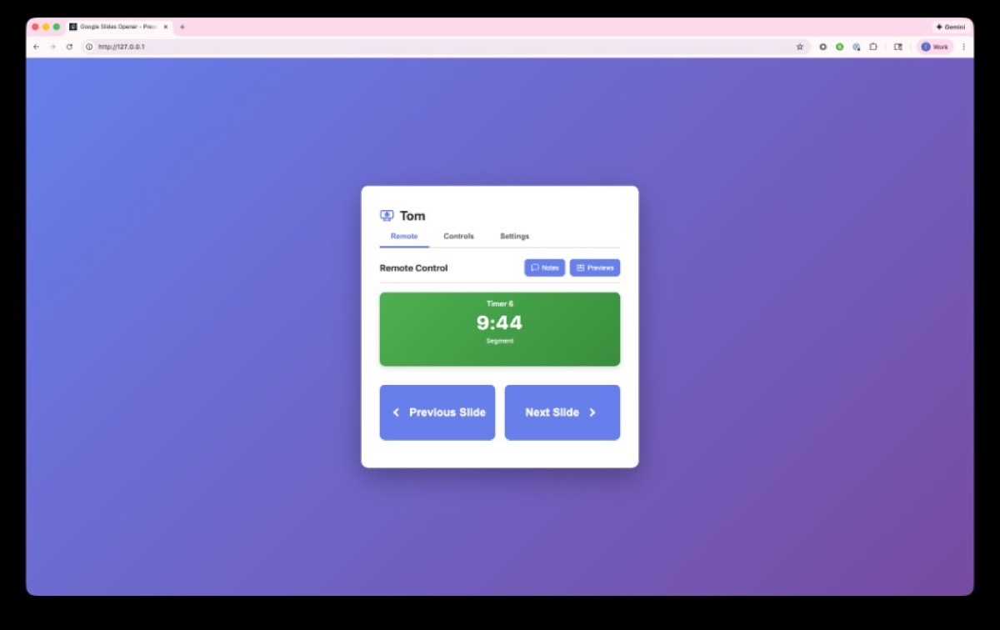
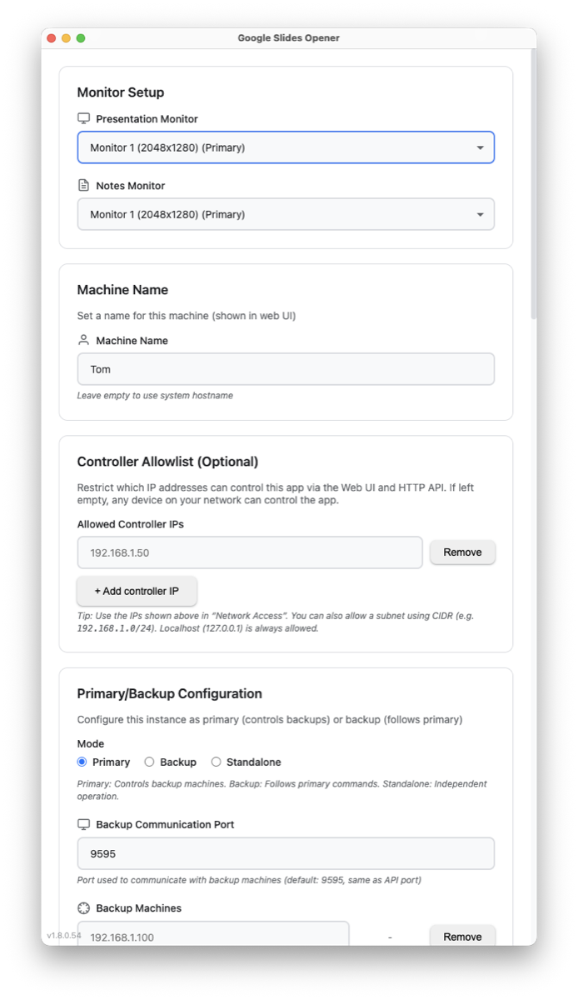

# Google Slides Opener

A desktop application for running Google Slides across multiple monitors, with a built-in Web UI remote and an HTTP API (for Bitfocus Companion or any other control system).



## High-level workflow

Run the Electron app on the **presentation computer**. It opens Google Slides full-screen on your chosen presentation monitor (and optionally opens speaker notes on a second monitor), while also serving **two control portals**:

- **Web UI (HTTP)**: a browser-based remote UI (default port **80**) usable from any device on your network (phones/tablets/laptops; Chrome/Chromium recommended).
- **HTTP API**: a machine-to-machine API (default port **9595**) for Bitfocus Companion and other systems that can send HTTP `GET`/`POST` commands.

## Attribution

This project is based on [nerif-tafu/gslide-opener](https://github.com/nerif-tafu/gslide-opener).

Original work by [nerif-tafu](https://github.com/nerif-tafu). This fork includes additional features and improvements.

## Installation

1. Download the latest release of **Google Slides Opener** onto your presentation computer.
2. **macOS users:** On first launch, you may see a security warning. This is expected behavior for non-notarized apps. Right-click the app and select **Open**. See [README-SECURITY.md](README-SECURITY.md).
3. Open the app and configure:
   - Presentation + Notes monitor selection
   - Network ports (Web UI + API)
   - (Optional) preset presentations, stagetimer integration, and primary/backup mode
4. If you use Bitfocus Companion, download `companion-module-gslide-opener.tgz` on your Companion machine and import it in Companion.

## Web UI (browser remote)

The Web UI is served by the Electron app (default: `http://YOUR_PRESENTATION_PC_IP`).

**Web UI (Remote tab)**


**Web UI (Controls tab)**


### Desktop app



### Tabs and intended users

- **Remote** (presenter-facing)
  - Big **Previous/Next** buttons (button text includes the target slide number)
  - Live **stagetimer.io** display (optional)
  - **Speaker notes** panel (toggleable) with scroll + zoom controls
  - **Slide previews** panel (toggleable) showing the **current** and **next** slide images (captured from Presenter View)
  - Notes + previews can be open **at the same time** (stacked), and the header UI collapses to maximize usable space

- **Controls** (operator-facing)
  - Open a presentation by URL (with or without speaker notes)
  - Open **preset** presentations (1/2/3)
  - Start speaker notes, close presentation, reload presentation, and slide navigation

- **Settings**
  - Monitor selection (presentation + notes)
  - Machine name (shown in the Web UI header)
  - Network ports (Web UI + API)
  - Primary/backup mode configuration (see below)
  - stagetimer.io connection settings (Room ID, API key, enable/visibility)
  - Verbose logging toggle (useful for troubleshooting)

### Primary/Backup mode (optional failover)

You can run multiple instances of the app across multiple computers for failover:

- **Primary**: the controlling instance
  - Configure **any number** of backup machines (IP or hostname)
  - Sends most operator commands to the backups so they “follow along”
  - **Reloads are NOT broadcast** (so you can reload one machine without disrupting the other)
  - Backup health can be monitored via the UI status indicators

- **Backup**: follows commands sent from the primary
- **Standalone**: normal single-machine mode

## Bitfocus Companion module

The Companion module connects to the app’s **HTTP API** (host + API port; default `127.0.0.1:9595` if Companion runs on the same machine, otherwise use the presentation PC IP).

### Setup in Companion

1. In Companion, go to **Modules** → **Import module package** and select `companion-module-gslide-opener.tgz`.
2. Add a connection for **Google Slides Opener**.
3. Set:
   - **Host**: the presentation computer IP (or `127.0.0.1` if Companion is on the same machine)
   - **Port**: the app’s API port (default **9595**)

### How it works

- The module sends commands to the app via HTTP `POST` actions.
- It polls `GET /api/status` every ~1 second to keep variables and feedbacks up to date.

### Actions

- Open Presentation (URL)
- Open Presentation with Notes (URL)
- Open Presentation 1 / 2 / 3 (preset)
- Close Current Presentation
- Next Slide
- Previous Slide
- Go to Slide (number)
- Reload Presentation
- Toggle Video Playback
- Open Speaker Notes
- Close Speaker Notes
- Scroll Speaker Notes Up / Down
- Zoom In / Zoom Out Speaker Notes

### Variables

- `presentation_open` (Yes/No)
- `notes_open` (Yes/No)
- `current_slide`
- `total_slides`
- `slide_info` (e.g. `3 / 10`)
- `next_slide`
- `previous_slide`
- `is_first_slide` (Yes/No)
- `is_last_slide` (Yes/No)
- `presentation_url`
- `presentation_title`
- `timer_elapsed` (e.g. `00:00:06`)
- `presentation_display_id`
- `notes_display_id`
- `login_state` (Yes/No)
- `logged_in_user` (email)

### Feedbacks

- Presentation is Open
- Speaker Notes are Open
- On Specific Slide (by slide number)
- Is First Slide
- Is Last Slide
- Logged In to Google

## Using the HTTP API (Companion, Q-SYS, StreamDeck, etc.)

Anything that can send HTTP `GET`/`POST` requests can control the app — for example, a Q-SYS Core could expose “Next/Previous slide” buttons on a UCI that send requests to the presentation computer.

The API port is configurable in the app (default **9595**). Requests are made to:

- `http://YOUR_PRESENTATION_PC_IP:9595`

### Endpoints

**Status**
- `GET /api/status` - Current state (open/closed, slide numbers, login state, etc.)

**Presentation control**
- `POST /api/open-presentation` - Open a presentation
  ```json
  { "url": "https://docs.google.com/presentation/d/YOUR_ID/edit" }
  ```
- `POST /api/open-presentation-with-notes` - Open a presentation and automatically start speaker notes
  ```json
  { "url": "https://docs.google.com/presentation/d/YOUR_ID/edit" }
  ```
- `POST /api/close-presentation` - Close current presentation
- `POST /api/reload-presentation` - Close and reopen the current presentation, returning to the same slide
- `POST /api/next-slide` - Go to next slide
- `POST /api/previous-slide` - Go to previous slide
- `POST /api/go-to-slide` - Navigate to a specific slide number
  ```json
  { "slide": 5 }
  ```
- `POST /api/toggle-video` - Toggle video playback

**Speaker notes + previews**
- `POST /api/open-speaker-notes` - Toggle speaker notes (s key)
- `POST /api/close-speaker-notes` - Close the speaker notes window
- `POST /api/scroll-notes-down` - Scroll speaker notes down (150px)
- `POST /api/scroll-notes-up` - Scroll speaker notes up (150px)
- `POST /api/zoom-in-notes` - Zoom in on speaker notes
- `POST /api/zoom-out-notes` - Zoom out on speaker notes
- `GET /api/get-speaker-notes` - Get current speaker notes content (for the Web UI)
- `GET /api/get-slide-previews` - Get current + next slide preview images (for the Web UI)

**Presets**
- `GET /api/presets` - Get all preset presentation URLs
- `POST /api/presets` - Set preset presentation URLs
  ```json
  {
    "presentation1": "https://docs.google.com/presentation/d/...",
    "presentation2": "https://docs.google.com/presentation/d/...",
    "presentation3": "https://docs.google.com/presentation/d/..."
  }
  ```
- `POST /api/open-preset` - Open a preset by number (1, 2, or 3)
  ```json
  { "preset": 1 }
  ```

**Configuration (used by Web UI + Desktop UI sync)**
- `GET /api/preferences`
- `POST /api/preferences`
- `GET /api/displays`
- `GET /api/backup-status` (primary mode)
- `GET /api/stagetimer-settings`
- `POST /api/stagetimer-settings`

### Example with curl

```bash
# Open a presentation
curl -X POST http://127.0.0.1:9595/api/open-presentation \
  -H "Content-Type: application/json" \
  -d '{"url":"https://docs.google.com/presentation/d/YOUR_ID/edit"}'

# Close presentation
curl -X POST http://127.0.0.1:9595/api/close-presentation
```

## Development (optional)

If you want to modify the source and run locally:

```bash
npm install
npm run dev
```

To build distributables:

```bash
npm run build:win # Builds the .exe for windows
npm run build:linux # Builds the appimage for Linux
./package-companion.ps1 # Builds the companion .tgz
```
