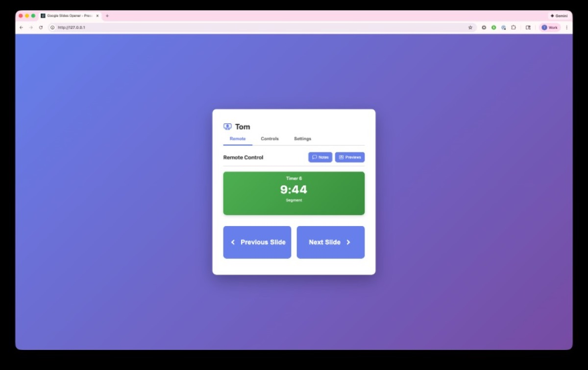
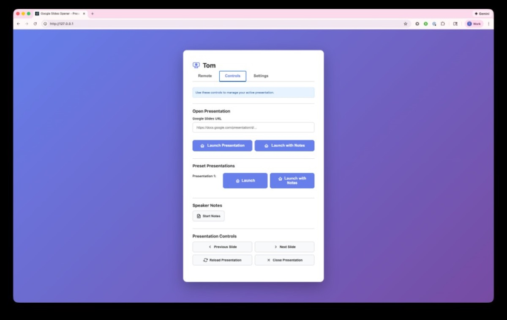
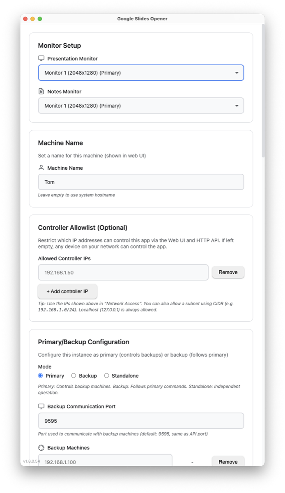

# Google Slides Opener

Control Google Slides presentations across multiple monitors with a web-based remote and API integration. Built for presenters, AV technicians, and control systems.

See [CHANGELOG.md](CHANGELOG.md) for recent updates.



## How it works

Run the app on your presentation computer. It opens Google Slides full-screen on your main monitor and optionally shows speaker notes on a second screen. Two control options let you run the show from anywhere:

- **Web UI** (port 80 by default): Browser-based remote control from phones, tablets, or laptops. Chrome or Chromium recommended.
- **HTTP API** (port 9595 by default): Direct API access for Bitfocus Companion, control systems, and custom integrations.

## Setup

1. Download the latest release to your presentation computer.
2. On macOS, you'll see a security warning on first launch (expected for non-notarized apps). Right-click the app and select **Open**. See [README-SECURITY.md](README-SECURITY.md) for details.
3. Configure the app:
   - Choose which monitors show the presentation and speaker notes
   - Set network ports for Web UI and API (defaults: 80 and 9595)
   - Optionally add preset presentations, stagetimer integration, and primary/backup setup
4. Using Bitfocus Companion? Download and import `companion-module-gslide-opener.tgz` in Companion.

## Credits

Based on [nerif-tafu's gslide-opener](https://github.com/nerif-tafu/gslide-opener). This fork builds on that foundation with additional features and improvements.

## Web UI

Access the Web UI at `http://YOUR_PRESENTATION_PC_IP` (port 80 by default).





### Remote tab (presenter control)

- Large Previous/Next buttons with the target slide number displayed
- Live stagetimer.io timer (optional)
- Speaker notes panel with scroll and zoom controls. Line breaks display correctly.
- Slide previews showing current and next slides (from Presenter View)
- Stack notes and previews side-by-side. Header collapses to give you more screen space.

### Controls tab (operator panel)

- Open presentations by URL, with or without speaker notes
- Test presentations: open a built-in demo to verify your setup
- Preset presentations: save and recall your favorite shows (1, 2, or 3)
- Slide navigation, reload, and speaker notes controls

### Settings tab

- Monitor selection for presentations and speaker notes
- Machine name displayed in the Web UI header
- Network ports (Web UI and API)
- Primary/backup mode setup (see below)
- stagetimer.io integration settings (room ID, API key)
- Verbose logging for troubleshooting

### Primary/Backup mode

Run multiple instances across several computers for failover. The primary machine controls the backups, and they stay in sync.

- **Primary**: sends commands to any number of backups (reloads only affect the primary, not the backups)
- **Backup**: receives and follows the primary's commands
- **Standalone**: normal single-computer mode

## Public access and HTTPS

By default, the Web UI is HTTP-only and available on your local network only.

### Deploying WAN access (Cloudflare Quick Tunnel)

The app can start a **Cloudflare Quick Tunnel** from the desktop: **Settings → WAN Access**. That gives you an `https://….trycloudflare.com` URL you can share for remote control without opening your router.

**1. Put the `cloudflared` binary next to the app**

The tunnel needs the `cloudflared` executable. It is **not** downloaded at runtime.

| How you run the app | What to do |
|---------------------|------------|
| **Built release (.zip / installed .app)** | Before building, from the repo: `yarn download:cloudflared`. Electron-builder packs `resources/cloudflared/` into the app (`extraResources`). Rebuild after downloading so the binary is inside the release. |
| **Development (`yarn start`)** | Run once: `yarn download:cloudflared` (populates `resources/cloudflared/` for your OS/arch). |

The download script is `scripts/download-cloudflared.sh` (macOS uses the official `.tgz` archives).

**2. Enable the tunnel**

1. Start the app and open **Settings → WAN Access**.
2. Turn **Quick Tunnel** on. When the Web UI server is listening, the app spawns `cloudflared` and shows the public URL (logs also list it).
3. Treat that URL like a **password**: anyone with it can use the **Remote** and **Controls** Web UI until you turn the tunnel off or quit the app.

**3. HTTPS Web UI on the presentation machine**

If the Web UI is served with **HTTPS** (including the app’s **self-signed** certificate), the tunnel uses **`--no-tls-verify`** toward your machine so the origin connection succeeds. Traffic between users and Cloudflare’s edge stays encrypted.

**4. Where the full Web UI (Settings tab) appears**

When Quick Tunnel is enabled, the in-browser **Settings** tab is **hidden** for requests that hit the Web UI through the tunnel (traffic arrives from `localhost` via `cloudflared`). **Remote** and **Controls** stay available. Remote users are **not** shown an in-page banner about this; it is documented here and in [docs/PUBLIC-ACCESS.md](docs/PUBLIC-ACCESS.md) for administrators.

- Use **`http://YOUR_LAN_IP`** (or your machine’s hostname on the network) for the **full** Web UI, including **Settings** and in-browser preset editing.
- Opening the Web UI at **`http://127.0.0.1`** on the same Mac while the tunnel is on is also treated as the restricted view (same localhost rule). Prefer the LAN URL for local admin.

The Web UI server also **blocks** proxying selected API calls from that restricted context (for example saving preferences or presets), so sensitive setup is not exposed only through the shared link. Direct access to the **API port** (9595) from the network is still governed by your **controller IP allowlist**—see [README-SECURITY.md](README-SECURITY.md).

### Other ways to expose the Web UI

- **Manual tunnel**: Install [cloudflared](https://developers.cloudflare.com/cloudflare-one/connections/connect-apps/install-and-setup/installation/) or [ngrok](https://ngrok.com/) and point it at your Web UI port (default **80**).
- **Reverse proxy**: nginx or Caddy with TLS (e.g. Let’s Encrypt) in front of the presentation machine.
- **In-app HTTPS** (LAN): Settings → serve Web UI over HTTPS (custom or self-signed PEM). Browsers may warn on self-signed certs; tunnels/proxies with real certs are better for the public internet.

See [docs/PUBLIC-ACCESS.md](docs/PUBLIC-ACCESS.md) for more detail, including manual Cloudflare/ngrok commands and security notes.

## Bitfocus Companion module

Integrate with Bitfocus Companion using the HTTP API on port 9595 (or your custom port).

### Install in Companion

1. Go to Modules, then Import Module Package
2. Select `companion-module-gslide-opener.tgz`
3. Add a new connection and set:
   - Host: your presentation computer IP (or `127.0.0.1` if Companion is on the same machine)
   - Port: your API port (default 9595)

### What it does

The module sends commands via HTTP POST and polls the status endpoint every second to sync variables and feedbacks.

### Available commands

Open Presentation, Open Presentation with Notes, Open Preset (1/2/3), Close, Next Slide, Previous Slide, Go to Slide, Reload, Toggle Video, Open/Close Speaker Notes, Scroll Notes, Zoom Notes.

### Variables

- `presentation_open`, `notes_open` (Yes/No)
- `current_slide`, `total_slides`, `slide_info` (e.g. "3/10")
- `next_slide`, `previous_slide`
- `is_first_slide`, `is_last_slide` (Yes/No)
- `presentation_url`, `presentation_title`
- `timer_elapsed` (e.g. "00:00:06")
- `presentation_display_id`, `notes_display_id`
- `login_state` (Yes/No)
- `logged_in_user` (email)

### Feedbacks

- Presentation is Open
- Speaker Notes are Open
- On Specific Slide (by number)
- Is First/Last Slide
- Logged In to Google

## HTTP API

Control the app from anywhere that can send HTTP requests. Q-SYS, StreamDeck, custom dashboards, or anything else. The API runs on port 9595 by default.

Base URL: `http://YOUR_PRESENTATION_PC_IP:9595`

### Status

- `GET /api/status` - Current state (presentation open/closed, slide numbers, login, etc.)

### Presentation control

- `POST /api/open-presentation` - Open a presentation by URL
  ```json
  { “url”: “https://docs.google.com/presentation/d/YOUR_ID/edit” }
  ```
- `POST /api/open-presentation-with-notes` - Open a presentation and start speaker notes
  ```json
  { “url”: “https://docs.google.com/presentation/d/YOUR_ID/edit” }
  ```
- `POST /api/close-presentation` - Close the current presentation
- `POST /api/reload-presentation` - Reload without changing the slide (preserves notes window size)
- `POST /api/next-slide` - Go to next slide
- `POST /api/previous-slide` - Go to previous slide
- `POST /api/go-to-slide` - Jump to a specific slide
  ```json
  { “slide”: 5 }
  ```
- `POST /api/toggle-video` - Toggle video playback

### Speaker notes and previews

- `POST /api/open-speaker-notes` - Show speaker notes window
- `POST /api/close-speaker-notes` - Hide speaker notes window
- `POST /api/scroll-notes-up` - Scroll notes up
- `POST /api/scroll-notes-down` - Scroll notes down
- `POST /api/zoom-in-notes` - Zoom in
- `POST /api/zoom-out-notes` - Zoom out
- `GET /api/get-speaker-notes` - Get current notes text (normalized line breaks)
- `GET /api/get-slide-previews` - Get images of current and next slides

### Presets

- `GET /api/presets` - Get all saved presets
- `POST /api/presets` - Save new presets
  ```json
  {
    “presentation1”: “https://docs.google.com/presentation/d/...”,
    “presentation2”: “https://docs.google.com/presentation/d/...”,
    “presentation3”: “https://docs.google.com/presentation/d/...”
  }
  ```
- `POST /api/open-preset` - Open a preset (1, 2, or 3)
  ```json
  { “preset”: 1 }
  ```

### Configuration

- `GET /api/preferences` - Get app settings
- `POST /api/preferences` - Update settings
- `GET /api/displays` - List available monitors
- `GET /api/backup-status` - Check backup machine health (primary mode only)
- `GET /api/stagetimer-settings` - Get stagetimer.io integration settings
- `POST /api/stagetimer-settings` - Update stagetimer settings

### Quick examples

```bash
# Open a presentation
curl -X POST http://127.0.0.1:9595/api/open-presentation \
  -H “Content-Type: application/json” \
  -d '{“url”:”https://docs.google.com/presentation/d/YOUR_ID/edit”}'

# Next slide
curl -X POST http://127.0.0.1:9595/api/next-slide

# Check status
curl http://127.0.0.1:9595/api/status
```

## Troubleshooting

Crash reports and logs are saved locally if something goes wrong. See [docs/CRASH-REPORTS.md](docs/CRASH-REPORTS.md) for where to find them and how to share them when reporting an issue.

## Development

Want to modify the code? Here's how to get started:

```bash
npm install
npm run dev
```

To build releases:

```bash
npm run build:win       # Windows .exe
npm run build:linux     # Linux AppImage
./package-companion.ps1 # Companion module
```
