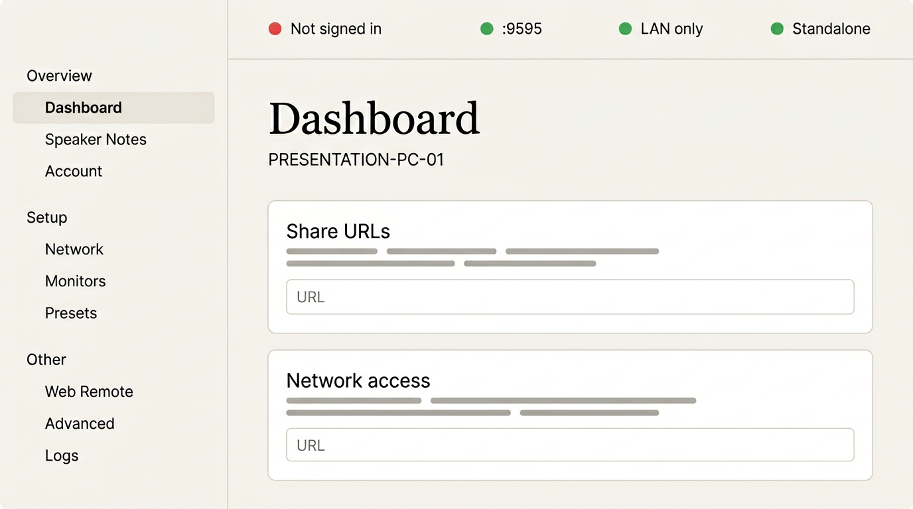
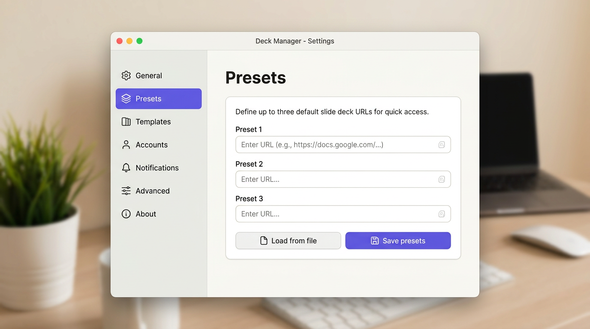
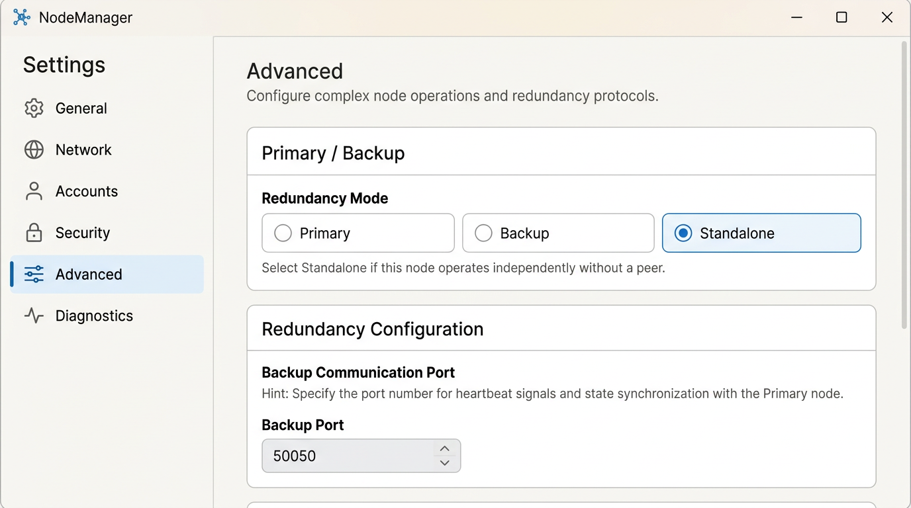
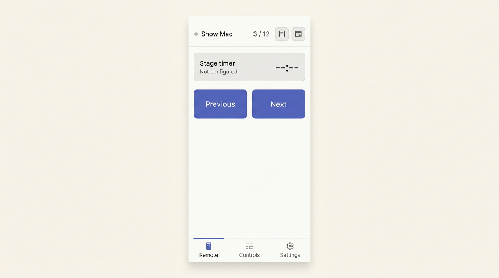
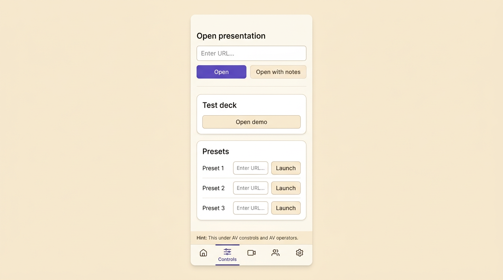

# Google Slides Opener

Run Google Slides fullscreen on one display, speaker notes on another, and drive the deck from a phone or over the HTTP API (e.g. Bitfocus Companion).

[Releases](https://github.com/TomsFaire/Google-Slides-Controller/releases) · [Changelog](CHANGELOG.md)

---

## macOS first launch

Unsigned builds often hit Gatekeeper. **Control-click the app → Open → Open**, or after a failed open use **System Settings → Privacy & Security → Open Anyway**.

If it still refuses to open (common after Safari unzip):

```bash
xattr -dr com.apple.quarantine "/Applications/Google Slides Opener.app"
```

Use your real path if the app lives elsewhere. Don’t run `xattr` over random trees—just the `.app` bundle. More on signing and the API allowlist: [README-SECURITY.md](README-SECURITY.md).

---

## Screenshots

**Desktop** — dashboard, presets, primary/backup (Advanced).







**Web** — light theme, Remote and Controls.





---

## Install and configure

1. Grab the latest **[release](https://github.com/TomsFaire/Google-Slides-Controller/releases)** (macOS ZIPs are arm64 + x64; Linux builds are there too).
2. Pick presentation and speaker-notes displays, set machine name and ports if you need non-defaults (**Web UI** default `80`, **API** default `9595`).
3. Optional: presets, stagetimer.io, primary/backup—all from the desktop settings window.

**Bitfocus Companion:** import `companion-module-gslide-opener.tgz` from the same release (**Modules → Import module package**). Host = PC running the app, port = API port (usually 9595). Module details: [companion-module-gslide-opener/README.md](companion-module-gslide-opener/README.md).

---

## Web UI and API

- **Web UI:** `http://<presentation-pc>` (same port as in settings). Remote / Controls / Settings in the browser; theme choice is in desktop **Web Remote** settings.
- **Keyboard shortcuts:** tap the keyboard icon in the Remote tab header to enable `Cmd+←/→` (previous/next slide) and `Cmd+↑/↓` (scroll speaker notes). On Windows/Linux use `Ctrl` instead of `Cmd`. Toggle state persists across page reloads. Shortcuts fire only while the browser tab has focus.
- **HTTP API:** `http://<presentation-pc>:9595` — mutating routes expect the controller IP allowlist (see [README-SECURITY.md](README-SECURITY.md)). Useful entrypoints: `GET /api/status`, `POST /api/next-slide`, `POST /api/open-presentation` with JSON `{"url":"…"}`.

**WAN / tunnel / PIN:** Quick Tunnel and optional PIN live under desktop **WAN Access**. Behavior and caveats (restricted vs full UI, localhost vs LAN) are spelled out in [docs/PUBLIC-ACCESS.md](docs/PUBLIC-ACCESS.md)—read that before sharing a URL.

---

## Troubleshooting and dev

- Crash dumps and log locations: [docs/CRASH-REPORTS.md](docs/CRASH-REPORTS.md).
- From a git checkout: `yarn install`, then `yarn start` (or `yarn dev` for watch). Builds: `yarn build:mac` / `yarn build:linux` / `yarn build:win`.
- Maintainer-only: regenerate `docs/images/*.png` with `yarn capture:readme-screenshots` (briefly forces Web UI port **8765**, then restores `preferences.json`).

Fork of [nerif-tafu/gslide-opener](https://github.com/nerif-tafu/gslide-opener).
